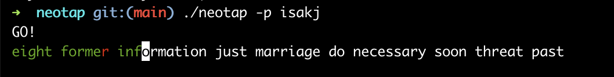

# Neotap

Terminal based keyboard speed typing game with detailed stats tracking and
visualizations.



## How to play

Follow the below steps to start playing:

1. Clone and step into the repo:

```bash
git clone https://github.com/IsakJacobsson/neotap.git
cd neotap
```

2. Build the game:

```bash
make
```

3. Play the game and store the stats to your name:

```bash
./neotap --player <NAME>
```

4. To customize how many words to type in a game, use the `-w/--num-words`
   option. For example to get 20 words:

```
./neotap --player <NAME> -w 20
```

## Visualize your stats

The stats are visualized with Python scripts. Before running the scripts you'll
have to install the required Python packages:

```
pip install -r requirements.txt
```

### Specific key speed over time

Run the `key_speed_over_time.py` script to show your history of typing speed for
a specific keyboard key.

```
python3 key_speed_over_time.py --player <NAME> --key <KEY>
```

### Various other stats

Run the `show_stats.py` to get a lot of other stats:

```
python3 show_stats.py --player <NAME>
```
